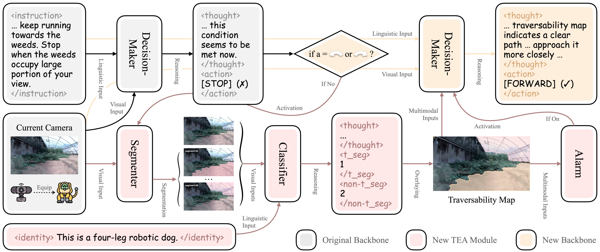
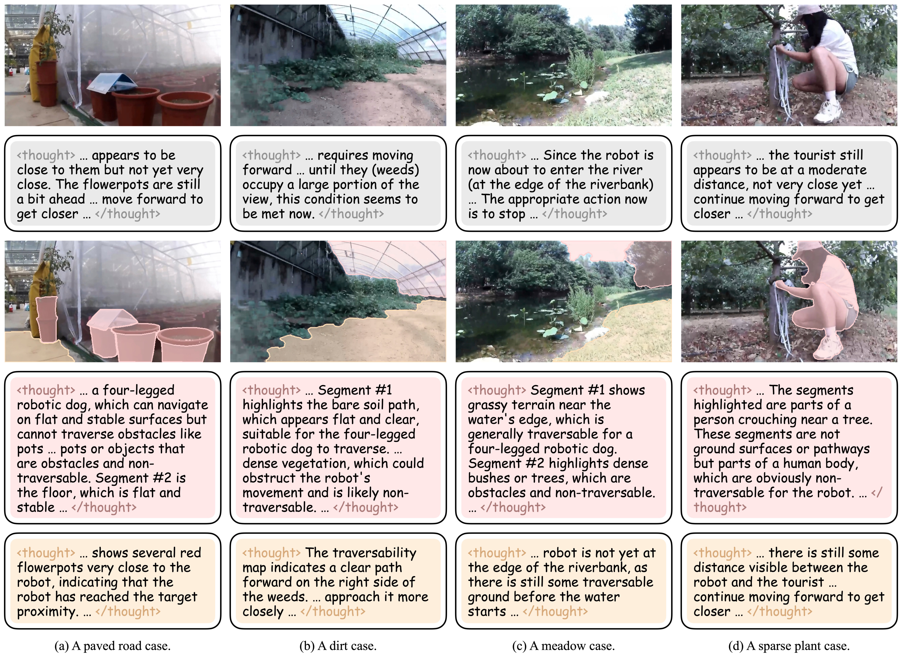

<div align="center">
<h1>TEA-AgriVLN: Traversability Estimation Alarm for Agricultural Vision-and-Language Navigation</h1>

[Xiaobei Zhao](https://orcid.org/0009-0005-3123-5536) · Xingqi Lyu · [Xin Chen](https://faculty.cau.edu.cn/cx/)<sup>✉️</sup> · [Xiang Li](https://faculty.cau.edu.cn/lx_7543/)<sup>✉️</sup>

**[China Agricultural University](https://ciee.cau.edu.cn)**

xiaobeizhao2002@163.com, lxq99725@163.com, chxin@cau.edu.cn, cqlixiang@cau.edu.cn

<p>
  <a href="https://arxiv.org/abs/2607.28474"></a>
  <a href="LICENSE"></a>
</p>


</div>

## Updates
<!-- - [June 8th, 2026] The codes of the IMAC-AgriVLN method are available in this repository. -->
- [July 30th, 2026] Our paper “TEA-AgriVLN: Traversability Estimation Alarm for Agricultural Vision-and-Language Navigation” is available for reading on [arXiv](https://arxiv.org/abs/2607.28474).

## Overview
Vision-and-Language Navigation in Continuous Environments (VLN-CE) requires an agent to follow a natural language instruction, predicting a sequence of low-level actions to navigate a robot from a starting point to a target location. The A2A benchmark and the AgriVLN method pioneeringly extended VLN-CE from indoor scenes to agricultural scenes, while we observed a challenging distinction: In indoor scenes, whether a zone is traversable tends to be clear to classify, such as wood floors are traversable but concrete walls are not. In agricultural scenes, however, this issue tends to be ambiguous, such as an unripe cornfield might be traversable for a robotic dog but might be non-traversable for a human. 

To address this issue, we propose the TEA module, which estimates the traversability of the camera image, then alarm the decision-maker for rethinking when the predicted action does not align with the traversability map. We integrate it into the AgriVLN backbone to build our TEA-AgriVLN method. When evaluated on A2A, it improves Success Rate (SR) from 0.47 to 0.54 and Navigation Error (NE) from 2.91 m to 2.70 m, showing the state-of-the-art performance in the agricultural VLN-CE domain. We further implement the ablation studies and the case study, discussing the effectiveness and limitations of TEA on different ground categories and scene classes.



## Quick Start
We are packaging the codes of TEA-AgriVLN. 
<!-- Now, our paper “TEA-AgriVLN: Traversability Estimation Alarm for Agricultural Vision-and-Language Navigation” is under review as a conference submission. After the paper is accepted, we will make  -->
<!-- Currently, the paper “IMAC-AgriVLN: Can Agricultural Vision-and-Language Navigation Agents be Aware of Instruction Mistakes?” is under review as a conference submission. After the paper is published, we will make both the A2A-MI benchmark and the IMAC-AgriVLN method available as soon as possible. -->

## Acknowledgment
This work is supported by the Sichuan Chengdu Modern Agricultural Industry Research Institute of China Agricultural University: Provincial and Municipal Agricultural Subsidy Funded Project; the Natural Science Foundation of Sichuan Province (2024NSFSC0389); and the Provincial and Municipal Agricultural Subsidy Special Funds for the Construction of CAU–SCCD Advanced Agricultural \& Industrial Institute. 
<!-- Thanks to Chiang Mai, Chiang Rai, and Bangkok for the impressive traveling experiences, giving us a chilled vibe for experiment and writing. Thanks to Yuanquan Xu, the inspiration to us. -->

## Citation
If our paper or method is helpful for your research, welcome you use the following citation:
```bibtex
@inproceedings{TEA-AgriVLN,
  title={TEA-AgriVLN: Traversability Estimation Alarm for Agricultural Vision-and-Language Navigation},
  author={Xiaobei Zhao and Xingqi Lyu and Xin Chen and Xiang Li},
  booktitle={arXiv:2607.28474},
  year={2026}
}
```

## Communication
If you have any issues with our study, welcome you contact the first author (Xiaobei Zhao, xiaobeizhao2002@163.com) to share your findings and thoughts with us.